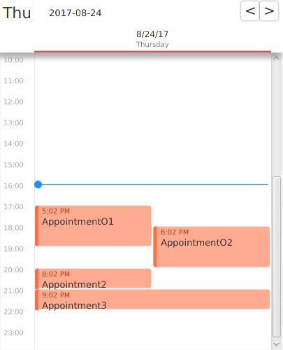
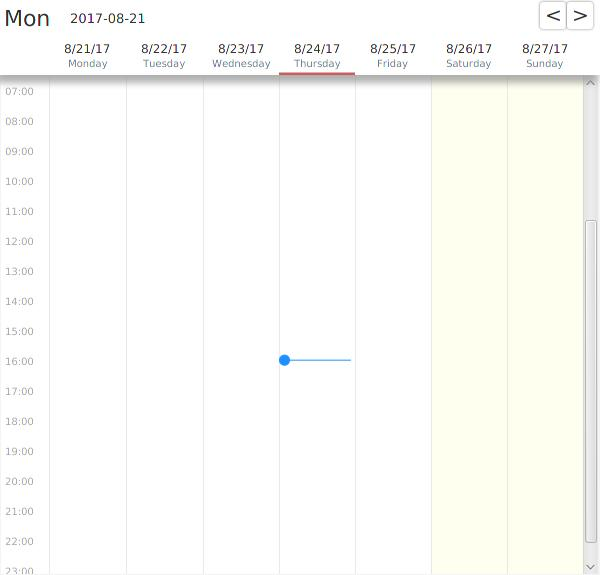
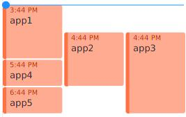

This software is licensed under GNU GPL v3.0  
See LICENSE.txt for further information.

# Fastis
Fastis (Latin for "calendar") is a fully featured calendar control for JavaFX. It is _still under heavy development_ and _APIs may change_.  
If you like the project please leave a ⭐! 🎉🎉

It provides a `WeekView` and a `DayView`. A `MonthView` will be added in the near future.  
All styling is done via CSS and the visual appearance and layout can be fully adjusted with custom renderers.

## Screenshots

### DayView

### WeekView

Both `DayView` and `WeekView` support different layout styles for overlapping appointments (e.g. `FLEX` and `STACKING`).  
Here is an example for the `FLEX` layout style:

